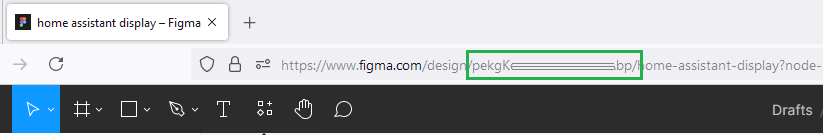

# Figma to ESPHome display code generator
Generates YML and C++ code for an [ESPHome display](https://esphome.io/components/display/) from a Figma document


TODO add "before and after" picture

## Features
 - Convert a Figma Ui design into code usable in an ESPHome display project
 - Supports Text, Line, Rectangle, Component, Instance, Group, Intance swap, etc.
 - Generates font definitions with only the actually used glyphs (to reduce built binary size)
 - Supports uploaded images

## Use it here: [https://notisrac.github.io/FigmaToESPHome/](https://notisrac.github.io/FigmaToESPHome/)

## How to use
Prepare your Figma design, then fill in the form with the appropriate data and click the ```Generate``` button

### Preparing the Figma design
 - Have a single frame that contains your design
 - Components/Instances are supported. (Components will be converted into functions, properties will be converted into parameters)
 - Naming items with ```var_``` prefix will be converted into variables in code. (names will be sanitized: "var_" prefix and anything not alphabetic will be removed)
 
 - You can "link" component properties with elements inside the component if you give them the same name (Note: the ```var_``` prefix should only be used in element names, not component properties!)
 (Note 2: ```var_temperaturehigh``` and ```Temperature_high``` also will be "linked" because of how the names are sanitized)
 
 - Use the instance swap feature in figma to specify which components can be displayed in that position. The generator will create a switch case based on the name of the instances.


### Figma Api URL
URL of the Figma API - you can leave this as is

### Figma Api Token
Your security token for the Figma Api - find more info on how to generate one, [here](https://www.figma.com/developers/api#access-tokens)

_Note that this key never leaves your browser other than communicating with the Figma API_

### Figma file key
The unique identifier of your Figma file.
You can find it in the URL of your design file:


### Page name
Name of the page, the design is on. E.g: ```Page 1```

### Frame name
The frame that contains the design. E.g: ```Frame 1``` or ```My awesome design```

## Result
What to do with the results

### YML
Copy these lines into your main ESPHome YML file, or save them in a new .yml file and include that in your main YML like [this](https://esphome.io/guides/configuration-types.html#yaml-insertion-operator)

Check all the generated font code: you will need to provide the font file path for each. Also the generator will add only the glyphs that are used in the design - if you need more, add them to the list of the respective font definition.
This is the default glyph set:
```!"%()+=,-_.:;°0123456789ABCDEFGHIJKLMNOPQRSTUVWXYZ abcdefghijklmnopqrstuvwxyz\'/&|``` _Note: the amount of glyphs used for a font wil impact the final binary size!_

### C++ functions
It is best to create a new .h file for these functions, then ```#include "./thatfile.h"``` in your main ESPHome display lambda code section

### C++ code
Copy these lines into your main ESPHome display lambda code section ([here](https://esphome.io/components/display/#display-rendering-engine)).
Make sure to assign a value to all of the variables!

### Files
These are the image files used in the Figma design. Download all of them into the forlder specified in the YML section!


## Troubleshooting
 - Any issues during the code generation will be display in an error box
 - A more detailed log is always written to the browser's console. Access it by opening the ```Developer tools``` either from the menu, or hitting the ```Ctrl + Shift + I``` button combination
 - Everything is running in your browser. The only outside resource is Figma's API that is used to retrieve the design file.
 - The code generator will not always produce ready-to-run code, you will need to fix all compiler issues
 - Not all Figma node types are supported! Create a pull request or ask in the issues of the repo
 - Not all concepts can be converted into working code from the design - some cases will require you to write additional code
 - Not all ESPHome Display component feature is supported (yet)
 - Issues with the code generator can be reported in the issues section
